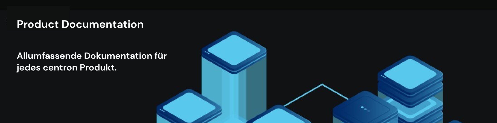

# © Product Docs Home

<figure><figcaption></figcaption></figure>

### Meist gesehene Product Docs

<table data-header-hidden><thead><tr><th>_</th><th>_</th><th data-hidden></th><th data-hidden></th></tr></thead><tbody><tr><td><ol><li><a href="https://app.gitbook.com/s/KMhKpeJSKbMbZqZ2Yud1/how-tos/domain-hinzufugen">Domains hinzufügen</a></li></ol></td><td><ol start="6"><li><a href="https://app.gitbook.com/s/KMhKpeJSKbMbZqZ2Yud1/how-tos/dns-records-verwalten">DNS Records bearbeiten</a></li></ol></td><td></td><td></td></tr><tr><td><ol start="2"><li><a href="https://app.gitbook.com/s/nAiHdZ56F9BowpPgLTfm/how-tos/via-konsole-verbinden">Mit VMs via Konsole verbinden</a></li></ol></td><td><ol start="7"><li><a href="https://app.gitbook.com/s/z4UpTEdBkqpuKhukqB8A/how-tos/airmail-einrichten/postfach-auf-gerat-einrichten">E-Mail Postfach auf Gerät einrichten</a></li></ol></td><td></td><td></td></tr><tr><td><ol start="3"><li><a href="https://app.gitbook.com/s/PyzNumjKYXiUD7cv784O/how-tos">SSL Zertifikat hinzufügen</a></li></ol></td><td><ol start="8"><li><a href="https://app.gitbook.com/s/KMhKpeJSKbMbZqZ2Yud1/how-tos">Domains managen</a></li></ol></td><td></td><td></td></tr><tr><td><ol start="4"><li><a href="https://app.gitbook.com/s/nAiHdZ56F9BowpPgLTfm/how-tos/vm-resize">VM Resize</a></li></ol></td><td><ol start="9"><li><a href="https://app.gitbook.com/s/o082PPUUPCRPO3E32ant/how-tos/vm-restore">VM aus einem Snapshot wiederherstellen</a></li></ol></td><td></td><td></td></tr><tr><td><ol start="5"><li><a href="https://app.gitbook.com/o/qZfyhEIOoMD2Tm025WII/s/KMhKpeJSKbMbZqZ2Yud1/">Subdomain hinzufügen</a></li></ol></td><td><ol start="10"><li><a href="https://app.gitbook.com/o/qZfyhEIOoMD2Tm025WII/s/ufElPMaUSQ8ykq2V49a8/"> Plattform Übersicht</a></li></ol></td><td></td><td></td></tr></tbody></table>

### Erste Schritte mit centron


[Platform Overview](https://app.gitbook.com/o/qZfyhEIOoMD2Tm025WII/s/ufElPMaUSQ8ykq2V49a8/)


***

<table data-card-size="large" data-column-title-hidden data-view="cards" data-full-width="false"><thead><tr><th></th><th></th><th></th><th data-hidden data-card-target data-type="content-ref"></th></tr></thead><tbody><tr><td> <a href="c-compute/"><strong>Compute</strong></a></td><td>Erstellen Sie Anwendungen, indem Sie Ihre eigene Infrastruktur mit <strong>ccloud³ Virtual Machines</strong> verwalten, nutzen Sie unsere PaaS-Umgebung mit dem <strong>ccenter</strong> oder geben Sie den Admin-Aufwand an uns ab mit <strong>Premium Full Managing</strong> und <strong>Premium Managed Services</strong>.</td><td></td><td><a href="c-compute/">c-compute</a></td></tr><tr><td> <a href="c-storage/"><strong>Storage</strong></a></td><td>Speichern Sie <strong>beliebige Datenmengen</strong> zuverlässig in der Cloud und greifen Sie schnell darauf zu. centron bietet Ihnen <strong>verschiedene Arten</strong> von <strong>Storage</strong>, je nach Ihren Bedürfnissen.</td><td></td><td><a href="c-storage/">c-storage</a></td></tr><tr><td> <a href="c-networking/"><strong>Networking</strong></a></td><td>Sichern und kontrollieren Sie den Traffic zu Ihren Anwendungen mit <strong>VPC-Netzwerken</strong>, <strong>Traffic Filtern</strong> und <strong>Load Balancern</strong>.</td><td></td><td><a href="c-networking/">c-networking</a></td></tr><tr><td> <a href="https://app.gitbook.com/s/ufElPMaUSQ8ykq2V49a8/billing"><strong>Billing</strong></a></td><td>Informationen zur Rechnungsstellung - einschließlich <strong>Rechnungen</strong>, <strong>Zahlungsmodalitäten</strong>, <strong>Zahlungsverzug</strong> und <strong>Steuern</strong>.</td><td></td><td><a href="https://app.gitbook.com/s/ufElPMaUSQ8ykq2V49a8/billing">Billing</a></td></tr><tr><td> <a href="https://app.gitbook.com/o/qZfyhEIOoMD2Tm025WII/s/ggVDhoR6duIDQi05PK9y/"><strong>Webhosting</strong></a></td><td>Hier finden Sie alle <strong>Details</strong> und notwendige Informationen zu Ihren <strong>Webhosting</strong> Paketen.</td><td></td><td><a href="https://app.gitbook.com/o/qZfyhEIOoMD2Tm025WII/s/ggVDhoR6duIDQi05PK9y/">Webhosting</a></td></tr><tr><td> <a href="https://app.gitbook.com/o/qZfyhEIOoMD2Tm025WII/s/s1TrDjcu8HAzQ6r6Z2YZ/"><strong>Colocation</strong></a></td><td>Informationen und Hard Facts zu Ihren Colocation Produkten, wie einzelnen <strong>Höheneinheiten</strong>, <strong>Strom</strong> &#x26; <strong>Traffic</strong>.</td><td></td><td><a href="https://app.gitbook.com/o/qZfyhEIOoMD2Tm025WII/s/s1TrDjcu8HAzQ6r6Z2YZ/">Colocation</a></td></tr></tbody></table>

