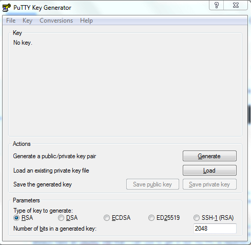

# Keys mit PuTTY erstellen

Um SSH-Schlüssel auf Windows zu erstellen und zu verwenden, benötigen Sie PuTTY und PuTTYgen. PuTTY ist ein Tool zum Herstellen von SSH-Verbindungen zu Remote-Servern, während PuTTYgen zum Erstellen von SSH-Schlüsseln verwendet wird. Hier finden Sie eine Anleitung zur Einrichtung und Verwendung:

### PuTTY und PuTTYgen herunterladen und installieren

1. **Download:** Besuchen Sie die PuTTY-Website und laden Sie die .msi-Datei im Bereich "Package files" unter "MSI ('Windows Installer')" herunter.
2. **Installation:** Installieren Sie die Datei auf Ihrem lokalen Computer, indem Sie sie doppelt anklicken und dem Installationsassistenten folgen.

### SSH-Schlüssel mit PuTTYgen erstellen

1. **PuTTYgen starten:** Öffnen Sie das Programm über das Startmenü oder durch Eingabe von "puttygen" nach dem Drücken der Windows-Taste.

<figure><figcaption></figcaption></figure>

2. **Parameter:** Sie können die Parameter am unteren Rand anpassen, die Standardwerte sind jedoch in den meisten Fällen geeignet. Für Fedora 33 wählen Sie aufgrund neuer Verschlüsselungsanforderungen ECDSA oder einen anderen unterstützten Algorithmus.
3. **Schlüssel generieren:** Klicken Sie auf "Generate" und bewegen Sie die Maus über den leeren Bereich, um Zufälligkeit (Entropie) für die sichere Schlüsselerstellung zu generieren.

<figure><figcaption></figcaption></figure>

4. **Öffentlichen Schlüssel kopieren:** Nach der Erstellung des Schlüssels wird der öffentliche Schlüssel in einem Textfeld angezeigt. Kopieren Sie diesen in Ihre Zwischenablage.
5. **Passphrase eingeben:** Geben Sie eine Passphrase für Ihren SSH-Schlüssel ein. Diese erhöht die Sicherheit, da niemand Ihren privaten Schlüssel verwenden kann, ohne auch die Passphrase zu kennen.

<figure><figcaption></figcaption></figure>

6. **Privaten Schlüssel speichern:** Klicken Sie auf "Save private key" und wählen Sie einen sicheren Speicherort. Die Erweiterung .ppk wird automatisch hinzugefügt.

### Umgang mit dem PuTTY-Public-Key-Format

Das Format des von PuTTYGen gespeicherten öffentlichen Schlüssels ist nicht mit den OpenSSH authorized\_keys-Dateien kompatibel, die für die SSH-Schlüsselauthentifizierung auf Linux-Servern verwendet werden.

Wenn Sie den öffentlichen Schlüssel im richtigen Format benötigen:

* Laden Sie den privaten Schlüssel in PuTTYgen.
* Der öffentliche Schlüssel wird erneut im geeigneten Format angezeigt.

### Nächste Schritte

**Öffentlichen Schlüssel zu Ihrem centron-Konto hinzufügen:**

Fügen Sie Ihren öffentlichen Schlüssel zu Ihrem centron-Konto hinzu, um ihn bei der Erstellung in neue ccloud³ VMs einbetten zu können.

**Öffentlichen Schlüssel zu bestehenden ccloud³ VMs hinzufügen:**

Fügen Sie Ihren öffentlichen Schlüssel zu bestehenden ccloud³ VMs hinzu, um die SSH-Schlüsselauthentifizierung für das Einloggen zu verwenden.

