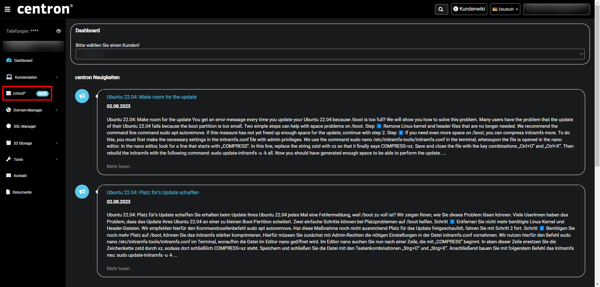
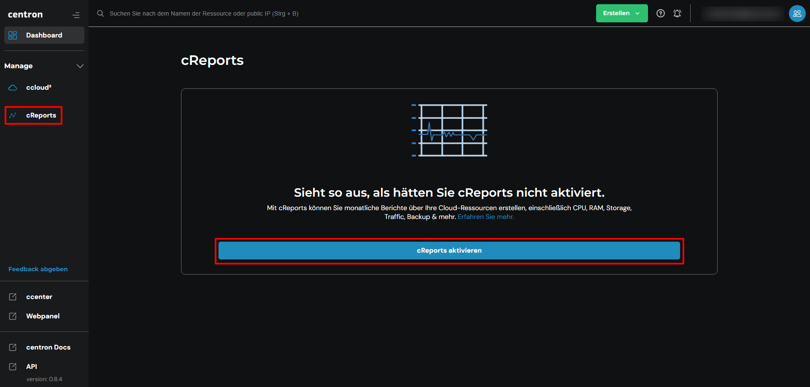

# Performance Reports aktivieren

## cReports

Sie können cReports selbst über das ccenter kostenfrei aktivieren. Die folgende Anleitung ist ein roter Faden, um Sie schnell und einfach durch das cCenter zu navigieren. \
\
**Achtung:** Es werden maximal bis zu **drei** Berichte in Ihrer Übersicht gespeichert. Danach werden Sie von neueren Berichten überschrieben.

## Aktivieren von cReports

1. Melden Sie sich mit Ihrer E-Mail-Adresse im [ccenter](https://ccenter.internet1.de/login) an\
   -> Alternativ können Sie sich direkt bei der [ccloud³](https://cloud.internet1.de/) anmelden
2. Wählen Sie links im Menü nun die [ccloud³](https://cloud.internet1.de/) aus

<figure><figcaption></figcaption></figure>

3. Wählen Sie nun im linken Menü den Punkt [cReports](https://cloud.internet1.de/creports) aus
4. Jetzt reicht ein einfacher Klick auf _cReports aktivieren_ und schon steht Ihnen ein ausführlicher Bericht am Ende des Monats zur Verfügung!

<figure><figcaption>
Unter dem Reiter cReports, die cReports aktivieren
</figcaption></figure>

##
