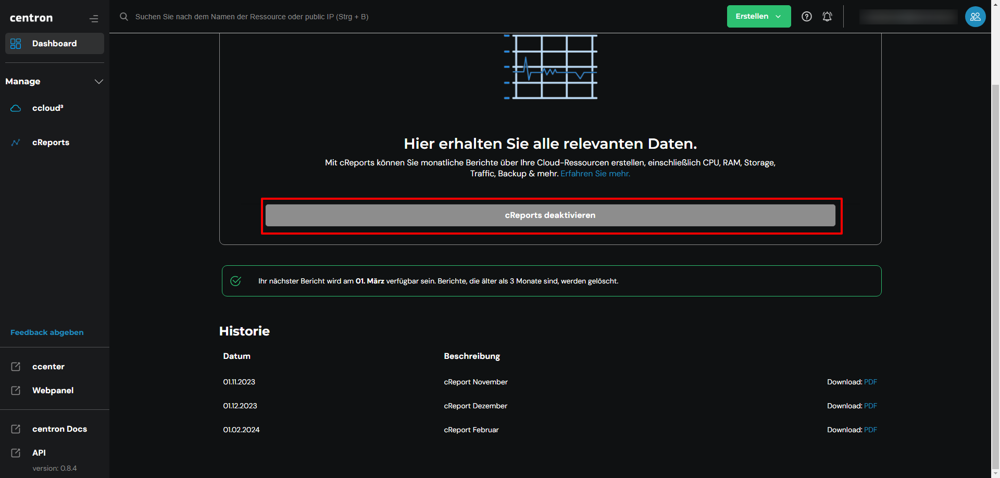

# Performance Reports deaktivieren

## cReports deaktivieren

Falls Sie sich dazu entscheiden, cReports nicht mehr in Anspruch nehmen zu wollen, können Sie es genauso einfach wieder deaktivieren. Navigieren Sie hierfür in die [cReports](https://cloud.internet1.de/creports) Ansicht in der [ccloud³](https://cloud.internet1.de/). Nun klicken Sie auf _cReports deaktivieren._ In Zukunft werden keine cReports mehr für Sie erstellt, bis zum erneuten aktivieren.

<figure><figcaption>
cReports deaktivieren
</figcaption></figure>
