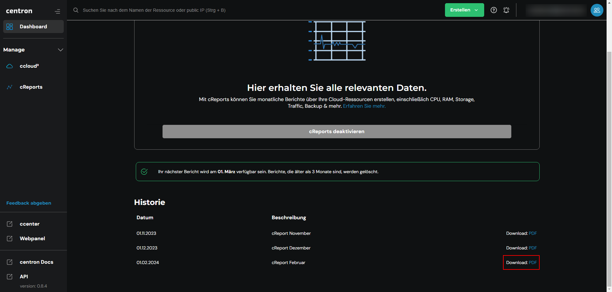

# Performance Reports herunterladen

## cReports herunterladen

Wenn Sie cReports aktiviert haben, steht Ihnen ein ausführlicher Bericht am Ende des Monats als PDF - Datei zur Verfügung. Um diese nun herunterzuladen, navigieren Sie zunächst in Ihre [cReports ](https://cloud.internet1.de/creports)Übersicht. Am Ende der Seite finden Sie eine Historie der letzten drei erstellten cReport - PDF - Dateien. Nun reicht ein klick auf **PDF** und der Bericht steht Ihnen im Ihren Download Ordner zur Verfügung.

<figure><figcaption>
cReports herunterladen
</figcaption></figure>

