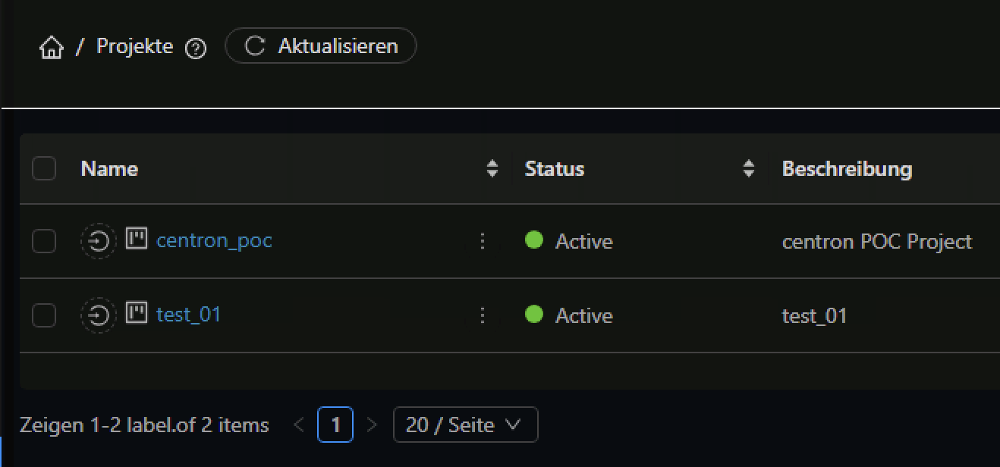

# Troubleshooting

## cStack Dashboard zeigt mir keine Werte an

Haben Sie in Ihrem cStack Account bereits Instanzen, K8s oder Netzwerke deployed und Ihnen werden dazu keine Werte im cStack Dashboard angezeigt dann können Sie das wie folgt lösen:

1. Navigieren Sie im cStack Webinterface auf den Navigationspunkt "Projekte"
2. Erstellen Sie ein neues Projekt (der genaue Name spielt hier keine Rolle)
3. Nachdem Sie ein Projekt erstellt haben können Sie dies in der cStack Ansicht oben auswählen
4. Nachdem Sie das neu erstellte Projekt ausgewählt haben wählen Sie wieder die "Standardansicht" aus
5. Schon sollten Ihnen die korrekten Werte im cStack Dashboard angezeigt werden

<figure><figcaption>
Ansicht der angelegten Projekte
</figcaption></figure>

<figure><figcaption>
Auswahl der Ansichten/Projekte
</figcaption></figure>

<figure><figcaption></figcaption></figure>
