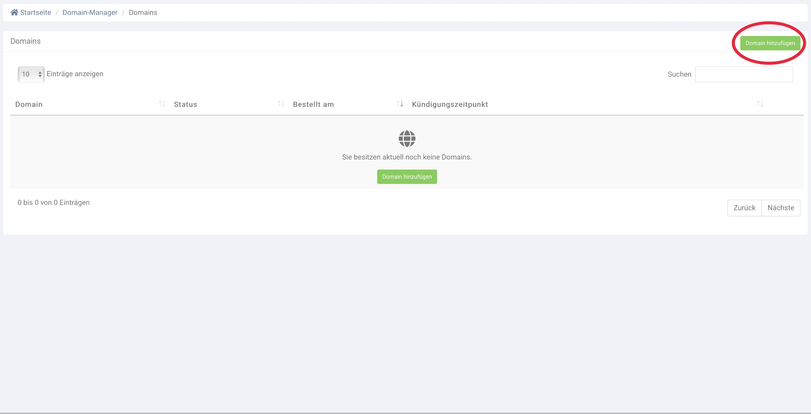

# Domain hinzufügen

## Kontakt anlegen

Bevor Sie eine Domain bestellen, müssen Sie einen Domainkontakt anlegen. Eine Beschreibung finden Sie unter "Domain Kontakte verwalten".

## Bestellung durchführen

Klicken Sie auf die grüne Schaltfläche **Domain hinzufügen**, um eine Domain zu bestellen.

<figure><figcaption></figcaption></figure>

Machen Sie Angaben zur Domain, indem Sie die Felder im darauffolgenden Formular befüllen.

<figure><figcaption></figcaption></figure>

<table><thead><tr><th width="265">Feld</th><th>Beschreibung</th></tr></thead><tbody><tr><td>Domain</td><td>Domainadresse</td></tr><tr><td>Admin-C</td><td>Administrativer Kontakt</td></tr><tr><td>Owner-C</td><td>Domaininhaber</td></tr><tr><td>Tech-C (wird generiert)</td><td>Technischer Kontakt</td></tr><tr><td>Zone-C (wird generiert)</td><td>Kontakt für die Namensverwaltung</td></tr><tr><td>Nameservers</td><td>Server für die Namensauflösung.</td></tr></tbody></table>

Schließen Sie die Bestellung über die grüne Schaltfläche **Bestellen** ab.
