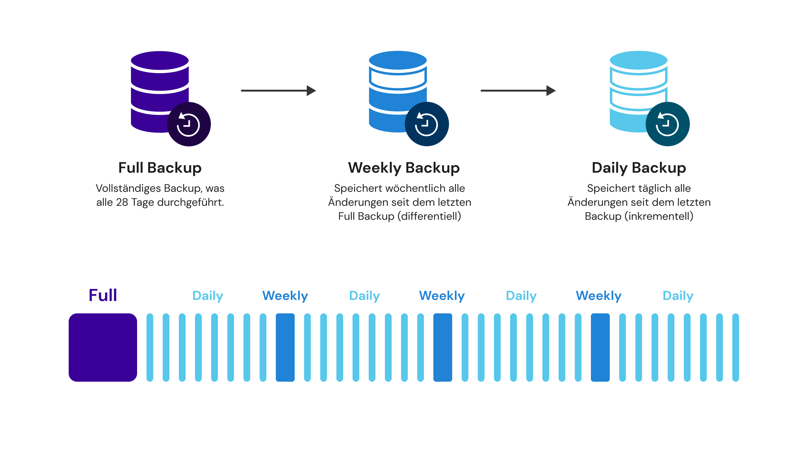

# File Based Backups (Premium Full Managing)

Bei centron unterscheiden wir generell zwischen drei unterschiedlichen Sicherungstypen. Den File Based Backups, die wir im Rahmen unseres Premium Full Managing anbieten, den kostenlosen Snapshots und den cBacks. Nachfolgend werden diese drei Begriffe voneinander abgegrenzt, bevor das File Based Backup näher erläutert wird.

#### **File-Based Backups vs. Snapshots vs. cBacks**

File-Based Backups sichern einzelne Dateien und Verzeichnisse, bieten granulare Wiederherstellungsmöglichkeiten, sind allerdings oft zeitaufwendig und ressourcenintensiv. Diese bieten wir im Rahmen unseres Premium Full Managing als Backup as a Service an. File Based Backups sind, wie der Name schon vermuten lässt, die bessere Wahl, wenn auf Datei-Ebene Sicherungen vorgenommen werden sollen.

Snapshots hingegen erstellen zeitpunktbezogene Kopien eines gesamten Dateisystems oder Volumens auf Blockebene, sind schnell und effizient, und verbrauchen weniger Ressourcen. Diese kann jeder Nutzer für sein System manuell in der ccloud³ erstellen. Mittels Snapshots muss allerdings im Wiederherstellungsfall das gesamte System wiederhergestellt werden und nicht nur einzelne Dateien.

cBacks sind eine automatisierte Variante von Snapshots, die von centron zur Verfügung gestellt wird. Sie können selbst einstellen, in welchen Zeitintervallen automatisch cBacks erstellt werden sollen.

#### **Wie funktioniert die Sicherung bei File Based Backups?**

Bei centron werden die Sicherungen der Systeme nach dem Generationenprinzip abgelegt, auch als Großvater-Vater-Sohn-Prinzip bekannt. Dies bedeutet eine monatliche Vollsicherung Ihres Systems, auf der wöchentliche und tägliche Sicherungen aufbauen. Diese Sicherungskette wird solange vorgehalten, bis Ihr Ablaufdatum (EOL = End Of Life) erreicht ist. Sollte ein Fehler in einer Datei erst später festgestellt werden, so ist es möglich, eine andere Version als den letzten aktuellen Stand wiederherzustellen. Hier handelt es sich jedoch nicht um eine Versionsverwaltung.

<figure><figcaption></figcaption></figure>

#### **Wohin wird gesichert?**

Um das Risiko physikalischer Einflüsse zu minimieren, werden die Backup-Daten bei centron in einen anderen Brandschutzabschnitt des Rechenzentrums oder in einen zweiten Rechenzentrumsstandort (Georedundantes Backup) ausgelagert. Sollte Ihr System einen Hardwareschaden vorweisen, kann Ihre Datensicherung auf einer Ersatzhardware bereitgestellt werden.&#x20;

#### **Was wird gesichert?**

Gesichert werden Datenträger (HDD, SSD, etc.) des Betriebssystems, sämtliche weitere Datenträger und Partitionen oder auch komplette Exchange-Datenbanken. Von anderen Datenbanken werden tägliche Dumps erzeugt, die – je nach Größe – bis zu sieben Tage auf dem System lokal verbleiben. Somit stellen wir eine noch schnellere Wiederherstellung sicher. Diese Dumps werden zusätzlich in der täglichen Sicherung aufbewahrt. Ausgenommen sind temporäre Daten, da diese vom System im laufenden Betrieb selbst erstellt werden und für eine Wiederherstellung nicht relevant sind. Hiervon abweichende Vereinbarungen können gerne in Abstimmung getroffen werden.

#### **Wann und für welchen Zeitraum wird gesichert?**

centron führt Backups für Systeme auf Basis von folgendem Zeitplan durch:

* Alle 4 Wochen Full-Backup
* Wöchentlich differentielles Backup auf letztes Full-Backup&#x20;
* Täglich inkrementelles Backup auf letztes wöchentliches inkrementelles Backup&#x20;
* Backup Vorhaltezeit von 28 Tagen

#### **Wie setzt sich mein Backup Wert zusammen?**

Ihr Backup setzt sich aus den gesicherten Dateien Ihrer Server und virtuellen Machinen zusammen, das im Laufe der letzten 30 Tage gesichert wurde. Das genaue [Sicherungsschema wird hier beschrieben](file-based-backups-premium-full-managing.md#wie-funktioniert-die-sicherung-bei-file-based-backups).

Um Ihnen das gewohnt gute Preis-Leistungsverhältnis von centron bieten zu können, deduplizieren wir Ihre Backups, sodass sich Ihr verbrauchter Backup Speicher um durchschnittlich 30% reduziert.
