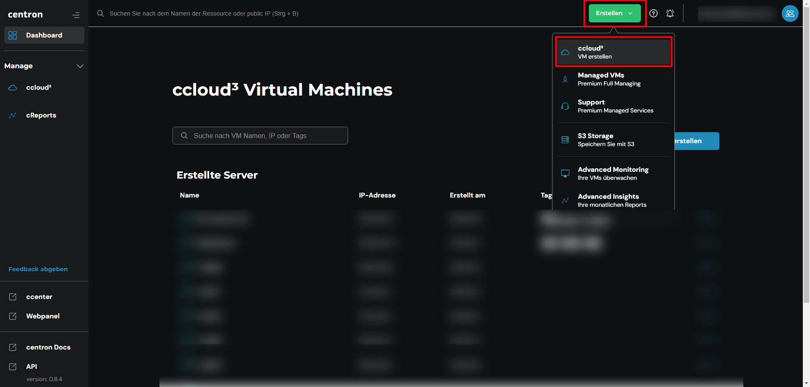
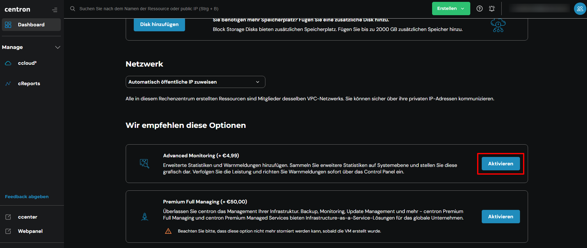
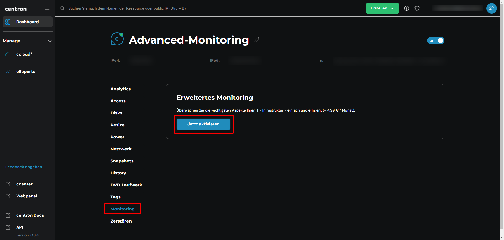

# Advanced Monitoring aktivieren

## Advanced Monitoring

Sie können Advanced Monitoring selbst über das ccenter aktivieren. Die folgende Anleitung dient als Hilfestellung, um das Advanced Monitoring für Sie einzurichten.

## Für einen neuen Server buchen

1.  Melden Sie sich mit Ihrer E-Mail-Adresse im [ccenter](https://ccenter.internet1.de/login) an

    -> Alternativ können Sie sich direkt bei der [ccloud³](https://cloud.internet1.de/) anmelden&#x20;
2. Wählen Sie links im Menü nun die [ccloud³](https://cloud.internet1.de/) aus

<figure><figcaption>
ccloud³ auswählen
</figcaption></figure>

4. Gehen Sie nun auf _Erstellen_ und wählen _VM erstellen_

<figure><figcaption>
ccloud³ neuen vServer erstellen
</figcaption></figure>

5. Hier haben Sie nun die Möglichkeit, das Advanced Monitoring zu aktivieren. Drücken Sie hierfür einfach auf den Knopf _Aktivieren_, so wird es automatisch für Sie mit gebucht!

<figure><figcaption>
Advanced Monitoring aktivieren
</figcaption></figure>

## Für einen bestehenden Server buchen

1. Melden Sie sich mit Ihrer E-Mail-Adresse im [ccenter](https://ccenter.internet1.de/login) an\
   -> Alternativ können Sie sich direkt bei der [ccloud³](https://cloud.internet1.de/) anmelden&#x20;
2. Wählen Sie links im Menü nun die [ccloud³](https://cloud.internet1.de/) aus
3. Klicken Sie jetzt auf den Server, für welchen Sie das Advanced Monitoring aktivieren möchten

<figure><figcaption>
Gewünschten Server auswählen
</figcaption></figure>

4. Navigieren Sie zum Punkt _Monitoring_ und wählen _Jetzt aktivieren_, um das Advanced Monitoring für diesen Server zu buchen

<figure><figcaption>
Monitoring aktivieren
</figcaption></figure>
