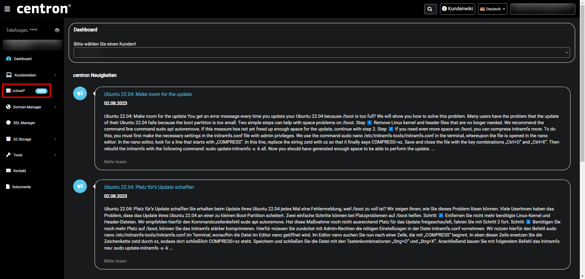
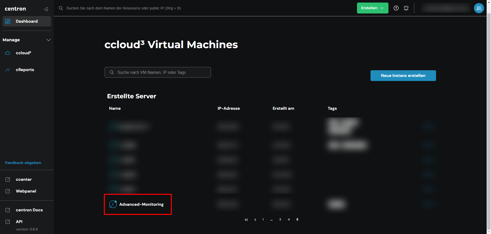
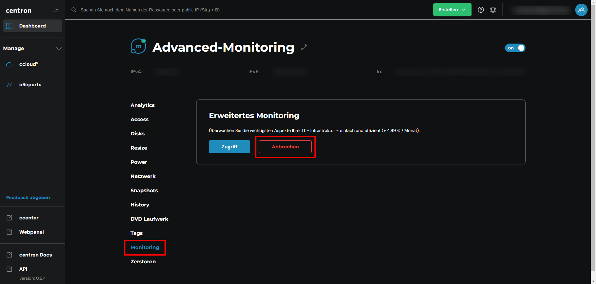

# Advanced Monitoring deaktivieren

## Advanced Monitoring deaktivieren

Falls Sie sich dafür entscheiden, das Advanced Monitoring zu kündigen, können Sie das erneut über das ccenter Wahrnehmen. Im Folgenden finden Sie einen Leitfaden.

## Advanced Monitoring für einen Server deaktivieren

1. Melden Sie sich mit Ihrer E-Mail-Adresse im [ccenter](https://ccenter.internet1.de/login) an\
   -> Alternativ können Sie sich direkt bei der [ccloud³](https://cloud.internet1.de/) anmelden&#x20;
2. Wählen Sie links im Menü nun die [ccloud³](https://cloud.internet1.de/) aus

<figure><figcaption>
ccloud³ auswählen
</figcaption></figure>

3. Klicken Sie jetzt auf den Server, für welchen Sie das Advanced Monitoring deaktivieren möchten

<figure><figcaption>
Server auswählen
</figcaption></figure>

4. Navigieren Sie zum Punkt _Monitoring_ und wählen _Abbrechen_, um das Advanced Monitoring für diesen Server zu kündigen

<figure><figcaption>
Advanced Monitoring deaktivieren
</figcaption></figure>

