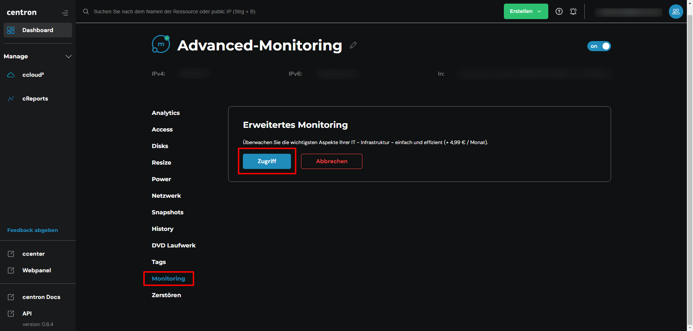
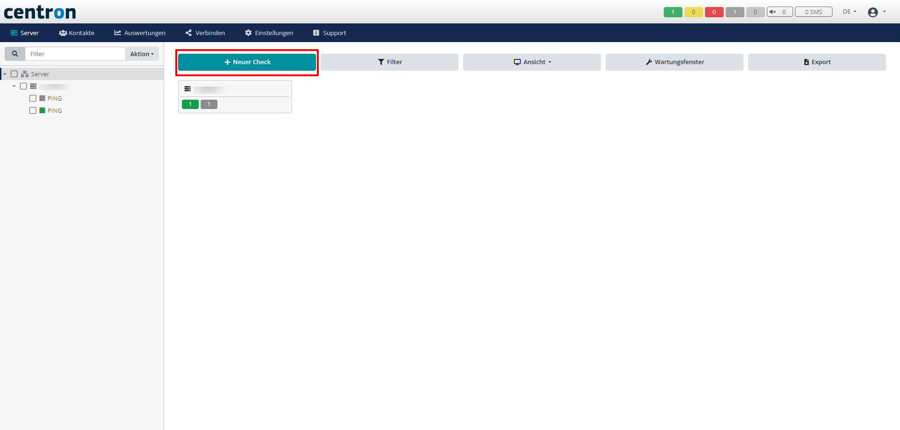

# Checks erstellen

Sie können ganz einfach Checks für Ihr System erstellen. Diese Anleitung soll Ihnen als roter Faden dienen, um selbst Checks anlegen zu können

## Checks für den gewünschten Server anlegen

1. Navigieren Sie zu der Monitoring Übersicht auf Ihrem Server und klicken Sie auf _Zugriff_&#x20;

<figure><figcaption>
Monitoringübersicht Ihres Servers
</figcaption></figure>

2. Klicken Sie nun auf _Neuer Check_, um einen Check anzlegen

<figure><figcaption>
Neuen Check anlegen
</figcaption></figure>

3. Wählen Sie nun aus, für was Sie den Check anlegen möchten. Tragen Sie dann die benötigten Daten ein und drücken auf _Speichern_ und schon haben Sie einen neuen Check angelegt!
