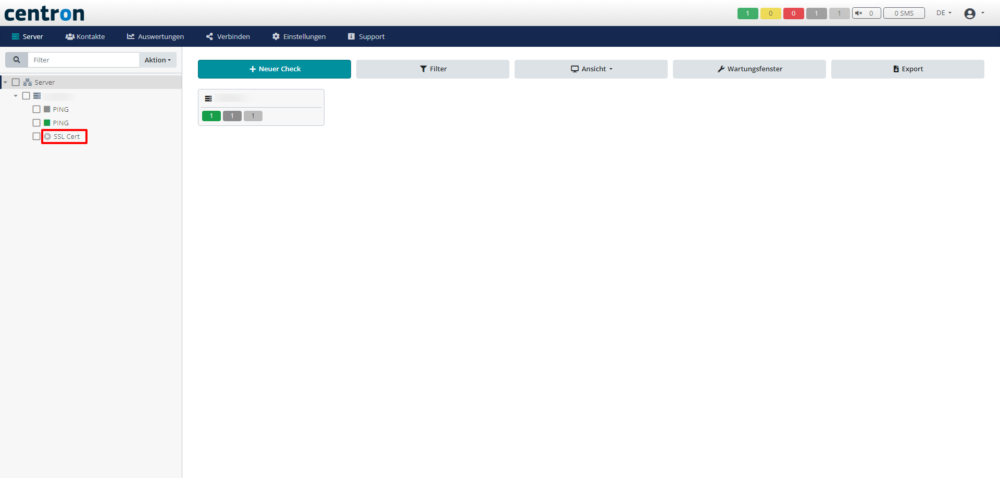

# Checks löschen

Falls ein Check nicht mehr benötigt wird, kann er jederzeit wieder entfernt werden. Diese Anleitung dient als roter Faden, um Ihnen das Löschen zu vereinfachen.

## Bestehende Checks löschen

1. Wählen Sie im linken Menü den Check aus, welchen Sie löschen möchten

<figure><figcaption>
Gewünschten Check auswählen
</figcaption></figure>

2. Klicken Sie nun auf den Menüpunkt _Aktion_ und danach auf _Löschen_. Jetzt nur noch das Pop-up fenster Bestätigen und der Check ist gelöscht

<figure><figcaption>
Gewählten Check löschen
</figcaption></figure>
