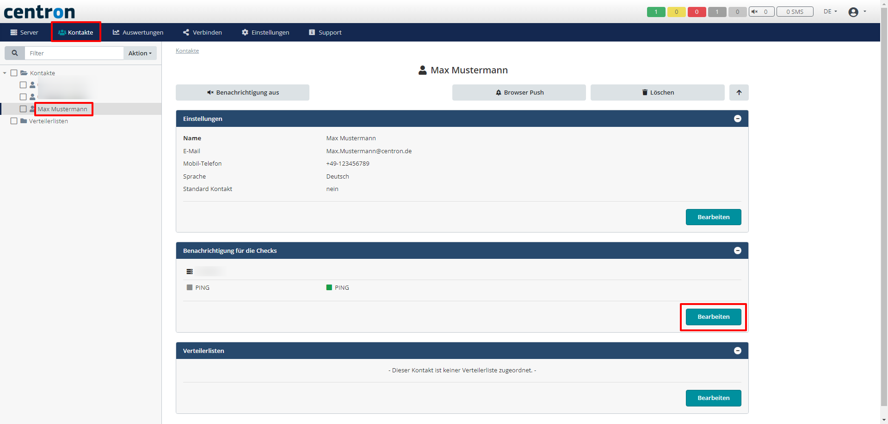

# Warnungen erstellen

Durch das Erstellen von Warnungen haben Sie die Möglichkeit, wichtige Server Benachrichtigungen auf dem Smartphone oder per Mail zu erhalten. Diese Anleitung soll Ihnen näher bringen, wie man diese Warnungen für sein System aktivieren kann

1. Klicken Sie in der oberen Leiste auf _Kontakte_ und legen Sie einen Kontakt nach Ihren Vorstellungen an

<figure><figcaption>
Neuen Kontakt anlegen
</figcaption></figure>

2. Wählen Sie links in der Liste nun den Kontakt aus, für welchen Sie die Warnungen anlegen wollen.\
   Danach noch bei _Benachrichtigung für die Checks_ den Knopf _Bearbeiten_ anklicken

<figure><figcaption>
Warnungen aktivieren
</figcaption></figure>

3. Jetzt nur noch die Server und Checks anwählen, für welche der Kontakt eine Benachrichtigung erhalten soll und mit _Speichern_ bestätigen

<figure><figcaption></figcaption></figure>
