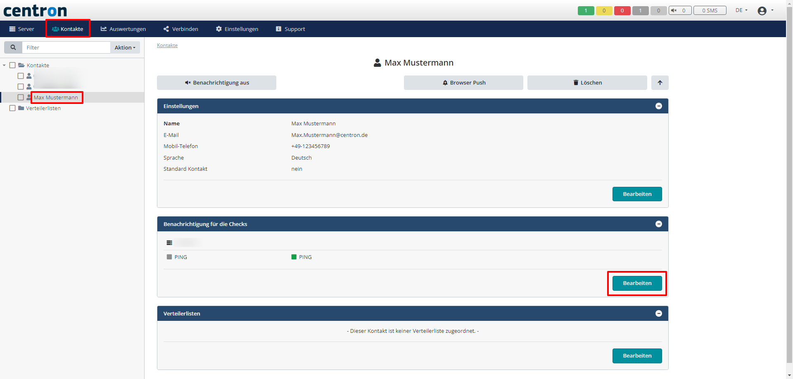
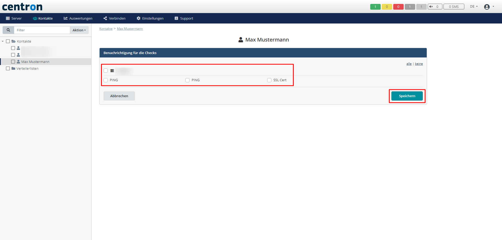

# Warnungen löschen

Wenn Warnungen nicht mehr benötigt werden, haben Sie die Möglichkeit diese ganz einfach zu entfernen. Diese Anleitung dient als roter Faden, um Ihnen das Löschen der Warnungen näher zu bringen.

1. Navigieren Sie in der oberen Leiste auf _Kontakte_ und klicken auf den Kontakt, für welchen Sie die Warnungen löschen möchten. Danach bei _Benachrichtigung für die Checks_ den Knopf _Bearbeiten_ anwählen

<figure><figcaption>
Gewünschten Kontakt anwählen
</figcaption></figure>

2. Nun wählen Sie alle Checks bzw. Server ab, für welche der Kontakt **keine** Benachrichtigung mehr erhalten soll und bestätigen diesen Vorgang mit _Speichern_

<figure><figcaption>
Checks an- bzw. abwählen
</figcaption></figure>
