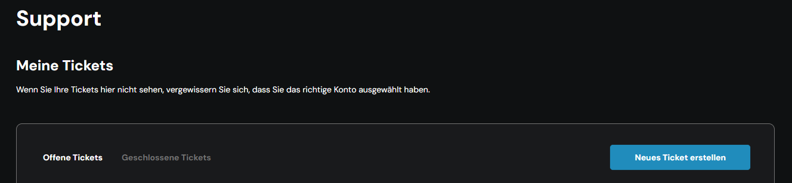

# Support via Account Center

**Wichtig:** Ab dem **13.10.2025** erfolgen einige Änderungen beim Support: Ticketerstellung nur noch über das Account Center; telefonischer Support bleibt für Managed‑Services‑Kunden und die exklusive Durchwahl wird im ccloud³ Dashboard angezeigt.

***

### Kurzanleitung (Checkliste) 

1. Zugang zum Account Center erhalten
2. Zum Reiter **Support** navigieren
3. „Neues Ticket erstellen“ anklicken
4. Abteilung und Produktkategorie wählen
5. Betreff und Nachricht eingeben (Pflichtfelder)
6. Anhänge hinzufügen (max. 3)
7. Ticket absenden und Bestätigung prüfen
8. Status in der Ticket‑Übersicht verfolgen / Ticket schließen

***

### Voraussetzungen 

* Aktiver Account mit Zugangsdaten für https://account.centron.de
* Moderner Browser (aktuelle Version von Chrome/Edge/Firefox/Safari)
* Bei Managed Services: ggf. spezielle Durchwahl im ccloud³ Dashboard für telefonischen Support

***

### Schritt‑für‑Schritt Anleitung 

#### Schritt 1 — Zugang zum Account Center 

1. Öffnen Sie https://account.centron.de.
2. Melden Sie sich mit Ihrem Benutzernamen und Passwort an.

**Tipp:** Falls Sie keinen Zugang haben, wenden Sie sich an Ihren Administrator oder an das centron Sales/Support‑Team über das Kontaktformular auf der Website.

***

#### Schritt 2 — Zum Reiter „Support“ navigieren 

1. Nach dem Login klicken Sie in der Menüleiste auf **Support**.
2. Auf der Support‑Seite sehen Sie eine Übersicht Ihrer aktuellen (offenen) und abgeschlossenen Tickets.

<figure><figcaption></figcaption></figure>

#### Schritt 3 — Neues Support‑Ticket erstellen 

1. Klicken Sie auf **Neues Ticket erstellen**.
2. Es öffnet sich ein Dialog/Fenster mit folgenden Feldern:
   * **Abteilung:** Wählen Sie zwischen _Technischer Support_, _Abrechnung & Buchhaltung_ oder _Sonstiges_.
   * **Produktkategorie:** Wählen Sie die passende Kategorie aus dem Dropdown.
   * **Servername (optional):** Tragen Sie optional einen Servernamen ein, wenn sich Ihre Anfrage auf ein konkretes System bezieht.

<figure><figcaption></figcaption></figure>

***

#### Schritt 4 — Betreff & Nachricht 

1. **Betreff:** Kurze, präzise Beschreibung (Pflichtfeld).
2. **Nachricht:** Ausführliche Beschreibung des Anliegens (Pflichtfeld).

**Hinweis zur Qualität:** Beschreiben Sie den Fehler / das Anliegen mit folgenden Angaben, falls verfügbar:

* Zeitpunkt, wann das Problem auftrat
* Reproduktionsschritte
* Fehlermeldungen (voller Wortlaut)
* Betroffene Dienste/Server

<figure><figcaption></figcaption></figure>

***

#### Schritt 5 — Anhänge hinzufügen 

* Sie können bis zu **drei** Anhänge hinzufügen. Die erlaubten Dateiformate werden im Info‑Tooltip angezeigt.

**Praxis‑Tipp:** Hängen Sie Log‑Ausschnitte, Screenshots der Fehlermeldung oder Konfigurationsdateien an. Kürzen Sie große Dateien, wenn möglich

<figure><figcaption></figcaption></figure>

***

#### Schritt 6 — Ticket absenden & Bestätigung 

1. Klicken Sie auf **Ticket erstellen**.
2. Sie erhalten unmittelbar eine Empfangsbestätigung per E‑Mail.
3. Das neue Ticket erscheint in Ihrer Ticket‑Übersicht.

***

#### Schritt 7 — Ticket verfolgen und weitere Informationen hinzufügen 

* Sie können den Ticket‑Thread jederzeit öffnen und zusätzliche Nachrichten oder Anhänge ergänzen.
* Antworten des Supports erhalten Sie per E‑Mail oder direkt im Account Center.

***

#### Schritt 8 — Ticket schließen 

* Wenn das Problem gelöst wurde oder das Ticket versehentlich erstellt wurde, klicken Sie in der Ticket‑Ansicht auf **Ticket schließen** (Button rechts).\

<figure><figcaption></figcaption></figure>

***

### Hinweise zu Support‑Änderungen (ab 13.10.2025) 

* **Keine Ticketerstellung mehr per E‑Mail:** Anfragen an technik@centron.de, billing@centron.de oder vertrieb@centron.de sind ab dem genannten Datum nicht mehr möglich. Bitte nutzen Sie das Account Center.
* **Telefonischer Support:** Bleibt für Kunden mit Managed Services erhalten (24/7). Die exklusive Telefonnummer finden Sie im ccloud³ Dashboard.
* **SLA & Reaktionszeiten:** Bei Managed‑Systemen gelten die im Vertrag vereinbarten SLAs. Für schnellere Reaktionszeiten oder einen dedizierten Account Manager kann Managed Services gebucht werden.

***

### Vorlagen für Ticket‑Texte (Copy & Paste) 

**Störungsmeldung — Beispiel**

* **Betreff:** Störung: Webserver nicht erreichbar – srv‑web‑01
* **Nachricht:** Seit 10:15 Uhr ist der Webserver srv‑web‑01 nicht erreichbar. Fehlermeldung: "Connection timed out". Reproduktionsschritte: 1) curl http://srv‑web‑01, 2) Browser zeigt Timeout. Logs: \[kurzen Ausschnitt einfügen].

**Abrechnungsanfrage — Beispiel**

* **Betreff:** Frage zur Rechnung 2025‑08 – Kundennr. 12345
* **Nachricht:** Bitte prüfen Sie die Position "Managed Services" auf Rechnung 2025‑08. Ich vermisse die vereinbarte Rabattvereinbarung.

**Allgemeine Anfrage — Beispiel**

* **Betreff:** Anfrage: SSL‑Zertifikat erneuern
* **Nachricht:** Bitte informieren Sie mich über die notwendigen Schritte, um das SSL‑Zertifikat für example.com zu erneuern.

***

### Häufige Fragen & Fehlerbehebung 

* **Keine Empfangsbestätigung per E‑Mail erhalten?** Prüfen Sie Ihren Spam‑Ordner und ob die in Ihrem Account hinterlegte E‑Mailadresse korrekt ist. Alternativ das Ticket‑Portal prüfen.
* **Datei lässt sich nicht anhängen?** Dateiformat prüfen und Dateigröße reduzieren. Maximal drei Anhänge möglich.
* **Zugriff fehlt?** Kontaktiere Ihren internen Administrator oder das centron Support‑Team über das Kontaktformular.

***

### Kontakt & Supportzeiten 

&#x20;

* **Account Center:** https://account.centron.de
* **Managed Services Kunden:** Telefonischer Support 24/7 (Durchwahl im ccloud³ Dashboard)
* **Sales‑Anfragen:** Weiterhin über das Kontaktformular auf unserer Website
