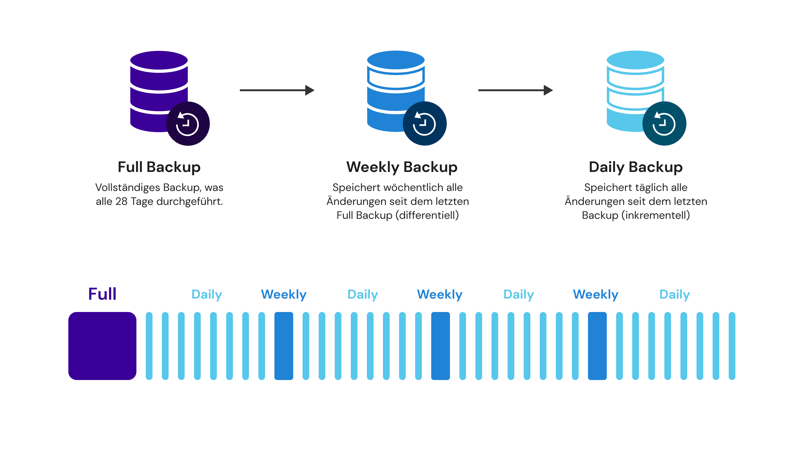

# Backup as a Service

Durch unsere neue Backuplandschaft können wir Ihnen zuverlässig die Sicherung Ihrer Daten ressourcenschonend und kosteneffizient anbieten.

<figure><figcaption></figcaption></figure>

Als tragende Software kommt hier **SEP Sesam** zum Einsatz. SEP Sesam ist ein Spezialist für die Themen Hybrid Backup & Disaster Recovery und betitelt sich selbst als „die globale Lösung Made in Germany“. Dank der Power dieser Software sind wir in der Lage, all Ihre Backups zentral zu verwalten oder zu kontrollieren. Großer Vorteil ist ebenfalls der deutsche Support, den wir bei auftretenden Problemen direkt kontaktieren können.\
Und das Schönste an der Sache? Alles zu 100 Prozent DSGVO konform!

In Bezug auf die Datensicherung stehen Ihnen folgende Optionen zur Verfügung:

* Sicherung in einen anderen Brandabschnitt (standardmäßig konfiguriert)
* Exklusives Target für Ihre Serverlandschaft
* Georedundante Sicherungen an unterschiedlichen Standorten

Wünschen Sie ein speziell auf Sie angepasstes Lösung, erarbeiten wir diese gerne anhand Ihrer Vorgaben.

Für eine hundertprozentige Datenintegrität bieten wir Ihnen folgende Leistungen:

* Überprüfung der ausgelesenen Daten via Checksumme (inklusive)
* Quartalsweise automatisierte Lesetests
* Vollständige Wiederherstellung einer Sicherung und Verifizierung

Eine Wiederherstellung von gelöschten, korrupten oder verloren gegangenen Dateien sowie eine Wiederherstellung eines kompletten Servers ist ebenfalls problemlos möglich.

#### Wie wird gesichert? 

Bei centron werden die Sicherungen der Systeme nach dem Generationenprinzip abgelegt, auch als Großvater-Vater-Sohn-Prinzip bekannt. Dies bedeutet eine monatliche Vollsicherung Ihres Systems, auf der wöchentlichen und täglichen Sicherungen aufbauen. Diese Sicherungskette wird solange vorgehalten, bis Ihr Ablaufdatum (EOL = End Of Life) erreicht ist.\
Sollte ein Fehler in einer Datei erst später festgestellt werden, so ist es möglich, eine andere Version als den letzten aktuellen Stand wiederherzustellen. Hier handelt es sich jedoch nicht um eine Versionsverwaltung.

#### Wohin wird gesichert? 

Um das Risiko physikalischer Einflüsse zu minimieren, werden die Backup-Daten bei centron mindestens in einen anderen Brandschutzabschnitt des Rechenzentrums ausgelagert.\
Sollte Ihr System einen Hardwareschaden vorweisen, kann Ihre Datensicherung auf einer Ersatzhardware bereitgestellt werden. Eine Auslagerung Ihrer Sicherung ist auch in ein zweites Rechenzentrum möglich (geografisch getrennt).

#### Was wird gesichert? 

Gesichert werden Datenträger (HDD, SSD, etc.) des Betriebssystems, sämtliche weitere Datenträger und Partitionen oder auch komplette Exchange-Datenbanken. Von anderen Datenbanken werden tägliche Dumps erzeugt, die – je nach Größe – bis zu sieben Tage auf dem System lokal verbleiben. Somit stellen wir eine noch schnellere Wiederherstellung sicher. Diese Dumps werden zusätzlich in der täglichen Sicherung aufbewahrt.\
Ausgenommen sind temporäre Daten, da diese vom System im laufenden Betrieb selbst erstellt werden und für eine Wiederherstellung nicht relevant sind.\
Hiervon abweichende Vereinbarungen halten wir im gemeinsamen Gespräch fest.

#### Wann und für welchen Zeitraum wird gesichert? 

centron führt Backups für Systeme auf Basis von folgendem Zeitplan durch:

* Alle 4 Wochen Full-Backup
* Wöchentlich differentielles Backup auf letztes Full-Backup&#x20;
* Täglich inkrementelles Backup auf letztes wöchentliches inkrementelles Backup&#x20;
* Backup Vorhaltezeit von 28 Tagen

Kontrolle und Überprüfung

Dank der Kommunikation unserer Backupsoftware und unseres Monitoring Systems sind wir immer über den aktuellen Stand aller Sicherungen informiert.

\
Unser Monitoring System meldet fehlgeschlagene oder nur zum Teil erfolgreiche Sicherungen direkt an unser internes Ticketsystem. Hierdurch wird sichergestellt, dass unser Backup Team jederzeit eingreifen und Probleme beheben kann.

\
Zusätzlich ist es möglich, in gewissen Abständen einen vollautomatischen Report einer Testwiederherstellung zu erhalten. Dies zeigt nicht nur, dass eine Sicherung erfolgreich stattgefunden hat, sondern dass auch eine Wiederherstellung verschiedener Dateien fehlerfrei funktioniert.
