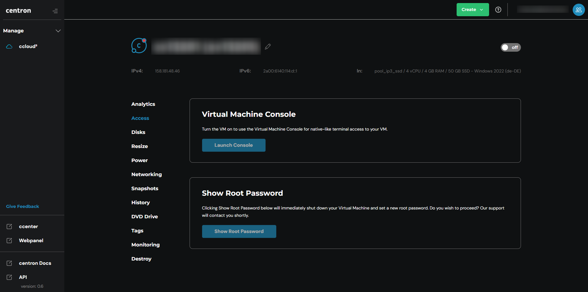

# Via Konsole verbinden

Die ccloud³ VM-Konsole bei centron bietet eine browserbasierte Möglichkeit, auf Ihre ccloud³ VMs zuzugreifen, ähnlich der Droplet Console bei DigitalOcean. Anstelle der Verwendung von SSH in einem lokalen Terminal können Sie die ccloud³ VM-Konsole in Ihrem bevorzugten Webbrowser nutzen.

Die ccloud³ VM-Konsole bietet ein nativ-ähnliches Terminalerlebnis, sodass Sie Befehle auf Ihrer VM über eine vertraute Befehlszeilenschnittstelle ausführen können. Sie ermöglicht außerdem einen Klick-SSH-Zugang zu Ihrer VM ohne die Notwendigkeit eines Passworts oder manueller SSH-Schlüsselkonfiguration.

## Voraussetzungen

Die ccloud³ VM-Konsole ist ohne zusätzliche Kosten für VMs verfügbar, die folgende Voraussetzungen erfüllen:

1. **Unterstütztes Betriebssystem:**
   * Die VM muss ein unterstütztes Betriebssystem ausführen.
   * Unterstützt werden alle von centron bereitgestellten Linux-Distributionen: Ubuntu, Debian, CentOS und Fedora. Dies schließt auch alle Marktplatz-Images ein, die auf diesen Distributionen basieren.
2. **Firewall-Konfiguration:**
   * Ihre Cloud-Firewall und alle Host-Firewalls müssen SSH-Verkehr auf dem Port akzeptieren, den der SSH-Daemon (sshd) verwendet.
   * Wenn eine Ihrer Firewalls SSH-Verkehr auf dem Port blockiert, auf dem der SSH-Daemon lauscht, müssen Sie deren Regeln so rekonfigurieren, dass eingehende SSH-Verbindungen auf diesem Port akzeptiert werden.

Die Nutzung der ccloud³ VM-Konsole bietet eine bequeme und sichere Möglichkeit, Ihre VMs zu verwalten, ohne sich um komplexe SSH-Key-Konfigurationen oder Terminal-Setups kümmern zu müssen. Es ist ein nützliches Tool, insbesondere für Benutzer, die eine einfachere, webbasierte Schnittstelle zur Interaktion mit ihren Servern bevorzugen.

Um auf die ccloud³ VM-Konsole bei centron zuzugreifen, folgen Sie diesen Schritten:

1. **Zugriff über das centron-Kontrollpanel:**
   * Loggen Sie sich in das centron-Kontrollpanel ein.
2. **VM auswählen:**
   * Klicken Sie auf den Namen der ccloud³ VM, auf die Sie zugreifen möchten, um das Detailfenster zu erweitern. Klicken Sie dann erneut auf den Namen, um zur Detailseite der VM zu gelangen.
3. **Accessbereich öffnen:**
   * Auf der Detailseite Ihrer ccloud³ VM klicken Sie auf den Reiter "Access" im linken Menü.
4. **ccloud³ VM-Konsole starten:**
   * Im Abschnitt "ccloud³ VM-Konsole" geben Sie den Benutzer an, als den Sie sich anmelden möchten, im Feld "Anmelden als…". Standardmäßig ist dies auf "root" gesetzt. Nachdem Sie einen Benutzer ausgewählt haben, klicken Sie auf "ccloud³ VM-Konsole starten", um die Konsole zu öffnen.
5. **Befehle ausführen:**
   * Wenn die Konsole geladen ist, können Sie die Befehlszeile nutzen, um Befehle auf Ihrer ccloud³ VM auszuführen.

<figure><figcaption></figcaption></figure>

### Hinweis

* Stellen Sie sicher, dass die erforderlichen Firewalleinstellungen korrekt konfiguriert sind, um den Zugriff auf die ccloud³ VM-Konsole zu ermöglichen.
* Die ccloud³ VM-Konsole ist ein nützliches Werkzeug für schnelle Zugriffe oder für Situationen, in denen SSH nicht verfügbar ist. Sie bietet eine einfache und intuitive Möglichkeit, Ihre VMs zu verwalten.
