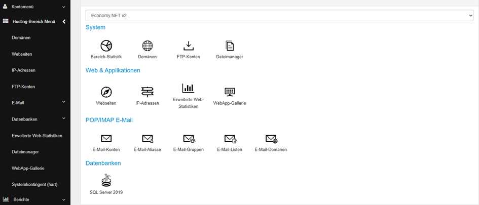

# SSL-Zertifikat installieren oder austauschen

Diese Anleitung beschreibt Schritt für Schritt, wie Sie ein **SSL-Zertifikat im Webpanel** oder im Plesk für Ihre Webseite unter Windows und Linux einrichten oder austauschen – sowohl mit **Let's Encrypt** als auch mit einem **Positive SSL Zertifikat**.&#x20;

### **SSL-Zertifikat installieren oder austauschen (Webpanel - Windows)**

&#x20;**Info:** Sollten Sie ein Multidomain- oder Wildcard-Zertifikat besitzen, das ausgetauscht werden muss, wenden Sie sich bitte an den technischen Support. Diese Zertifikate können nicht über das Webpanel ausgetauscht werden.&#x20;

### &#x20;1. Zugang zum Webpanel (Windows)

#### **1.1 Anmeldung**

Zum Tausch des Zertifikats loggen Sie sich bitte in unser Webpanel ein. Info: Der Benutzername ist hier Ihre Kundennummer.

\
👉 **https://webpanel.internet1.de/**


Nach dem Login sollte die Benutzeroberfläche wie gewohnt erscheinen.

**Hinweis:** Falls Sie kein Hosting-Paket sehen, klicken Sie in der linken Spalte (siehe Bild) auf den Menüpunkt **„Hosting-Bereich Menü“**.\
Dort finden Sie den Reiter **„Webseiten“**, über den Sie Ihre Domain verwalten und Zertifikate tauschen können.

<figure><figcaption></figcaption></figure>

***

#### 1.2 Webseite auswählen

Im Bereich **„Webseiten“** sehen Sie eine Übersicht aller Ihrer eingerichteten Domains (siehe Beispielbild).\
Klicken Sie auf die Webseite, für die Sie ein Zertifikat installieren oder aktualisieren möchten.

<figure><figcaption></figcaption></figure>

#### &#x20;1.3 Webseiten-Zeiger prüfen

Bevor Sie ein Zertifikat installieren, prüfen Sie bitte, ob sogenannte **Webseiten-Zeiger** verwendet werden. Dabei ist zu unterscheiden:

* **Nur temporäre centron-Domains eingebunden**\
  → Sie können diesen Schritt überspringen.
* &#x20;**Eigene Domains eingebunden**\
  → Bitte lesen Sie die nachfolgende ,,**Info‘‘** sorgfältig durch, da **weitere Schritte erforderlich** sind.


**Wichtige Info bei eigenen Domains:**

Wenn Sie im Bereich **„Webseiten-Zeiger“** (oben rechts) weitere Domains eingebunden haben, wenden Sie sich bitte **vor dem Zertifikatstausch** an den technischen Support.

**Grund:**\
Beim Austausch des Zertifikats mit mehreren Domains im Webseiten-Zeiger kann es dazu kommen, dass wichtige Bindungen **automatisch entfernt** werden und **nicht korrekt neu gesetzt** werden.\
Dies kann zu **Fehlfunktionen oder dem vollständigen Ausfall** der Webseite führen.



### 2. Einrichtung eines **Let's Encrypt** Zertifikats

#### 2.1 SSL aktivieren

* Gehen Sie auf den Reiter **„SSL“** (rechts auf der Seite, siehe Bild)
* Klicken Sie auf: **„Install a free certificate from Let's Encrypt“**

<figure><figcaption></figcaption></figure>

#### 2.2 Domains auswählen

* Unten links sehen Sie die Subdomain Ihrer Webseite, z. B. `www.zertifikattest.de`
* Rechts daneben sehen Sie die eingebundenen Domains aus den Webseiten-Zeigern

<figure><figcaption></figcaption></figure>


**Wichtig:** Halten Sie die **Shift-Taste gedrückt** und markieren Sie **alle Domains**, die SSL erhalten sollen.\
Nicht markierte Domains werden **nicht** in das Zertifikat aufgenommen.


#### &#x20;2.3 Bestätigung & Installation

* Lesen Sie die ,,Allgemeine Geschäftsbedingung‘‘ durch
* Setzen Sie den Haken bei **„Read Let’s Encrypt Terms of Service“**
* Klicken Sie anschließend auf **„Let’s Encrypt SSL installieren“**

Wenn alle Schritte korrekt ausgeführt wurden, sollte das Zertifikat erfolgreich installiert sein.


**Bei Fehlermeldungen wenden Sie sich bitte an den technischen Support.**


&#x20;

### &#x20;3. Einrichtung eines **Positive SSL** Zertifikats

#### 3.1 Zertifikat aus dem ccenter herunterladen

1. Melden Sie sich im **ccenter** mit Ihren Zugangsdaten an.
2. Navigieren Sie zum Bereich **„SSL-Manager“.**
3. Wählen Sie Ihr SSL-Zertifikat aus, das für Ihre Webseite erstellt wurde.

<figure><figcaption></figcaption></figure>

4\.    Laden Sie die Datei im Format `.pfx` herunter:

* Vergeben Sie dabei ein sicheres Passwort.
* Merken Sie sich dieses Passwort oder kopieren Sie es an einen sicheren Ort.


#### 3.2 Zertifikat im Webpanel hochladen

1. Öffnen Sie im Webpanel wieder Ihre Webseite (wie in Abschnitt 1).
2. Gehen Sie zum Reiter **„SSL“**
3. **Löschen Sie das alte Zertifikat**, um mögliche Fehler zu vermeiden.
4. Klicken Sie auf **„Zertifikat hochladen“ (siehe Bild).**

#### 3.3 Datei auswählen & installieren

* Klicken Sie auf **„Datei auswählen“** und laden Sie Ihre `.pfx`-Datei hoch.
* Geben Sie das zuvor festgelegte Passwort ein.
* Bestätigen Sie den Vorgang.

Das Zertifikat wird nun auf Ihrer Webseite installiert.

<figure><figcaption></figcaption></figure>

#### 3.4 Installation überprüfen

* Öffnen Sie Ihre Webseite im Browser.
* Klicken Sie oben links auf das **Schloss-Symbol** in der Adresszeile.
* Wählen Sie: **„Verbindung ist sicher“** → **„Zertifikat ist gültig“.**

&#x20;

<figure><figcaption></figcaption></figure>


Wenn noch das alte Zertifikat angezeigt wird, liegt das oft am **Browser-Cache**. Öffnen Sie die Seite ggf. im Inkognito-Modus oder leeren Sie den Cache.



#### 3.5 Zertifikat extern prüfen

Zur zuverlässigen Prüfung empfehlen wir den kostenlosen SSL-Checker:\
👉 [https://ssl-trust.com/SSL-Zertifikate/check](https://ssl-trust.com/SSL-Zertifikate/check)

* Geben Sie dort Ihre Domain ein

Sie erhalten eine detaillierte Übersicht zum aktuellen Zertifikat (z.B. die Gültigkeit).

&#x20;

### **SSL-Zertifikat installieren oder austauschen (Plesk – Linux)**

Diese Anleitung erklärt Ihnen, wie Sie ein SSL-Zertifikat in **Plesk** für Ihre Webseite einrichten oder austauschen – sowohl mit einem **kostenlosen Let’s Encrypt-Zertifikat** als auch mit einem **Positive SSL-Zertifikat** aus dem centron ccenter.

#### &#x20;1. Anmeldung in Plesk

Melden Sie sich in Ihrer Plesk-Umgebung an. Hier gibt es mehrere URLs.

```
https://mhweb-bbg-XX.internet1.de:8443/
```

```
https://vs12600.internet1.de:8443/
```

```
https://vs12601.internet1.de:8443/
```

```
https://vs12974.internet1.de:8443/
```

Ersetzen Sie das **XX** mit der Servernummer oder nehmen Sie die URL, die Sie von uns erhalten haben.


#### 2. Webseite auswählen & Zertifikatsbereich öffnen

Nach dem Login sehen Sie direkt Ihre Webseite(n). Falls nicht, klicken Sie auf die gewünschte Domain.

* Scrollen Sie nach unten zum Abschnitt **„Sicherheit“**
* Klicken Sie auf **„SSL/TLS-Zertifikate“**

<figure><figcaption></figcaption></figure>

### &#x20;1. Einrichtung eines **Let’s Encrypt-Zertifikats**

#### 1.1 Zertifikat beantragen

In der SSL-Übersicht erhalten Sie ggf. den Hinweis, dass Ihre Webseite nicht geschützt ist, sollte noch kein Zertifikat eingerichtet sein.

Die Ansicht könnte etwas abweichen, sollte ein Zertifikat bereits installiert sein.

* Klicken Sie auf den Button **„Kostenloses Basiszertifikat von Let's Encrypt installieren“** (unten links/mittig)

<figure><figcaption></figcaption></figure>

&#x20;

#### 1.2 Optionen auswählen & installieren

Ein neues Fenster öffnet sich:

* Wählen Sie, ob auch die Subdomain **„www.“** geschützt werden soll.
* Geben Sie eine gültige **E-Mail-Adresse** ein.
* Klicken Sie anschließend auf **„Kostenlos nutzen“.**

<figure><figcaption></figcaption></figure>


**Voraussetzung:** Die DNS-Einträge müssen korrekt gesetzt sein.


Wenn alles korrekt eingerichtet wurde, wird das Zertifikat automatisch installiert.


#### **INFO zur Subdomain „www“:**&#x20;

#### Wenn ein Kunde Ihre Seite mit **www.ihre-domain.de** aufruft und diese Subdomain **nicht im Zertifikat enthalten ist**, wird eine **Fehlermeldung** angezeigt („Diese Seite ist nicht sicher“).

#### &#x20;Setzen Sie daher am besten immer den Haken bei **„www“**.


&#x20;

### 2. Einrichtung eines **Positive-, Multi-Domain- oder Wildcard-SSL-Zertifikats**

&#x20;2.1 Zertifikatsdateien im ccenter herunterladen

1. Melden Sie sich im **centron ccenter** an.\
   👉 https://ccenter.centron.de/
2. Navigieren Sie zum **„SSL-Manager“.**
3. Wählen Sie Ihr Zertifikat aus, das für Ihre Webseite erstellt wurde.
4. Laden Sie die folgenden drei Dateien herunter:

* `.key`
* `.crt`
* `.ca-bundle`


<figure><figcaption></figcaption></figure>

#### 2.2 Zertifikat in Plesk hochladen


Hinweis bei **Multidomain- oder Wildcard-Zertifikaten**

**Das Zertifikat muss separat für jede Subdomain oder zusätzliche Domain hochgeladen werden.**


Dies betrifft insbesondere Szenarien mit mehreren Domains oder Subdomains innerhalb eines Webhosting-Pakets.

1. Öffnen Sie im Plesk-Bereich wieder Ihre Webseite (wie im zweiten Abschnitt).
2. Die Ansicht könnte etwas abweichen, sollte ein Zertifikat bereits installiert sein (siehe Bild).
3. Klicken Sie auf **„Vorhandene Zertifikate hochladen oder entfernen“.**
4. Klicken Sie auf **„SSL/TLS-Zertifikat hinzufügen“.**

<figure><figcaption></figcaption></figure>

#### 2.3 Zertifikatsinformationen eingeben

* Vergeben Sie einen **Namen** für das Zertifikat, z. B. `meine-domain.de_2025`
* Übernehmen Sie am besten den Domain Namen mit dem Jahr wo es getauscht wurde
* Füllen Sie alle Pflichtfelder (mit Stern \*) aus
* Scrollen Sie nach unten zum **Upload-Bereich**

<figure><figcaption></figcaption></figure>

#### 2.4 Zertifikatsdateien hochladen

* Wählen Sie die drei zuvor heruntergeladenen Dateien (.key, .crt, .ca-bundle) aus
* Achten Sie auf die **korrekte Zuordnung** (steht in Klammern hinter jedem Feld)
* Klicken Sie auf **„Zertifikat hochladen“**

<figure><figcaption></figcaption></figure>

#### 2.5 Zertifikat auf der Webseite aktivieren

1. Gehen Sie oben rechts zurück auf Ihre Webseite (blauer Link).
2. Klicken Sie in der Mitte auf **„Hosting und DNS“** → **„Hosting“.**
3. Scrollen Sie zum Abschnitt **„Zertifikat“.**\
   → Hier kann „Nicht ausgewählt“ stehen, oder ein anderes Zertifikat, sollte hier eins schon eingebunden sein.
4. Öffnen Sie das Auswahlfeld und wählen Sie das **neu hochgeladene Zertifikat** aus.
5. Klicken Sie auf **„Speichern“.**

<figure><figcaption></figcaption></figure>

&#x20;

#### 2.6 Installation überprüfen

1. Öffnen Sie Ihre Website im Browser.
2. Klicken Sie in der Adresszeile oben links auf das Schloss-Symbol
3. Wählen Sie: „Verbindung ist sicher“ → „Zertifikat ist gültig“.
4. Wird hier das neue Zertifikat angezeigt, müssen Sie nur noch das alte Zertifikat löschen (siehe 4.8).
5. Falls das neue Zertifikat nicht angezeigt wird, fahren Sie mit Schritt 4.7 fort.

Wenn noch das alte Zertifikat angezeigt wird, liegt das oft am **Browser-Cache**. Öffnen Sie die Seite ggf. im Inkognito-Modus oder leeren Sie den Cache.

&#x20;

#### 2.7 Zertifikat extern prüfen

Zur zuverlässigen Prüfung empfehlen wir den kostenlosen SSL-Checker:\
👉 [https://ssl-trust.com/SSL-Zertifikate/check](https://ssl-trust.com/SSL-Zertifikate/check)

* Geben Sie dort Ihre Domain ein

Sie erhalten eine detaillierte Übersicht zum aktuellen Zertifikat (z.B. die Gültigkeit).

&#x20;

#### 2.8 Altes Zertifikat löschen

1\.    Gehen Sie zurück in Ihr **Dashboard**.

2\.    Scrollen Sie nach unten und klicken Sie auf **„SSL/TLS-Zertifikate“**.

3\.    Wählen Sie oben mittig **„Erweiterte Einstellungen“** aus.

4\.    Sie sehen nun eine Übersicht Ihrer vorhandenen Zertifikate.

5\.    Wählen Sie das **alte Zertifikat** aus.

6\.    Prüfen Sie rechts neben dem grünen Pfeil, ob dort eine **„0“** angezeigt wird:


**0 =** Das Zertifikat wird aktuell von keinem Dienst mehr verwendet



**≠0 =** Das Zertifikat ist noch aktiv im Einsatz (z. B. „1“ oder mehr)


**Löschen Sie das alte Zertifikat nur**, wenn **alle Ihre Webseiten bereits auf die neuen Zertifikate** umgestellt wurden und beim alten Zertifikat eine „0“ steht.
